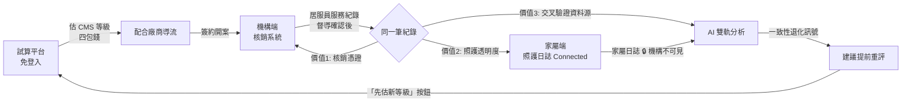

# CareEasy 照護一點通 — 優化執行規格書 v1
> 版本：2026-07-07｜適用時程：M3 (7/15) → 決賽 (7/22)
> 用途：每張任務卡為自包含 prompt，可直接複製給任何 AI 模型執行。
> 執行者（模型）只需依卡片內容作業，不需理解專案全貌。

---

## 0. 全域規則（每張任務卡開頭都必須附上這一段）

```
【全域規則 — 必須遵守】
1. 禁止修改 cmsEngine.js、careData.js 內任何費率數字與等級判定邏輯。
2. 所有涉及補助金額、部分負擔比率、法規文案的變更，完成後必須在
   PR 描述中標註「⚠️ 需 CMS Rules Specialist 驗證」，不可自行 merge。
3. 金額文案一律使用「最高」字樣；等級一律寫「CMS 2–8 級」；
   涉及核定的地方必須保留「須經各縣市長期照顧管理中心評估核定」。
4. 不新增任何 npm 套件，除非任務卡明確允許。
5. 完成後必須執行任務卡內的「驗收條件」自我檢查，逐條回報通過/未通過。
6. 只修改任務卡列出的檔案，不碰其他檔案。
```

---

## 1. 優先序總覽

| 優先 | 任務 | 對應里程碑 | 需 Specialist 驗證 |
|---|---|---|---|
| P0-1 | 串接敘事與 Demo 腳本（簡報用） | 7/22 決賽 | 否 |
| P0-2 | 邀請碼連動流程（家屬端 UI 骨架） | 7/15 | 否 |
| P0-3 | 費率合規驗證清單（部分負擔 / 外看 30%） | 7/15 blocking | **是（blocking）** |
| P1-1 | 家屬端日誌：快速標籤 chips | 7/15 | 否 |
| P1-2 | AI 訊號改為資料驅動 + 規則引擎 | 7/15 | **是**（訊號規則） |
| P1-3 | Solo 模式價值強化（試算結果帶入額度預估） | 7/15 | **是**（金額顯示） |
| P2-1 | OCR：Human-in-the-loop 確認流程 | 7/22 demo | 否 |
| P2-2 | OCR：後處理校正層（BA 碼白名單 + 範圍驗證） | 7/22 demo | 否 |
| P2-3 | 機構端差異標記規則表 | 7/22 demo | **是**（規則表） |

> 機構端 Alpine.js 系統**不重寫**。7/22 前以獨立頁面掛載於主站路由
> （例如 `/institution`），僅統一 header 視覺。整合為決賽後工作。

---

## 2. 核心串接架構（給全隊的共同語言）

**一句話：一筆居服紀錄，三種價值。**



**權限鐵律（產品與簡報一致）：**
- 服務紀錄：機構擁有 → 以「邀請碼」授權家屬檢視。
- 家屬日誌：家屬擁有 → 永不直接給機構；僅 AI 彙整訊號經家屬同意分享。
- 連動是可逆的：家屬可隨時解除，解除後回到 solo 模式，日誌資料保留。

---

## 3. 任務卡

---

### 【P0-1】串接敘事與 Demo 腳本
**產出物**：`docs/demo-script.md`（純文件，無程式碼）
**輸入**：本規格書第 2 節架構圖

**任務內容**：撰寫 7/22 決賽 Demo 腳本，總長 5 分鐘，含以下六幕。
每一幕需寫出：操作步驟（點哪裡）、口白（逐字稿）、預期畫面。

1. 第一幕（0:00–0:45）：出院場景痛點陳述 → 開啟試算平台，填問卷得 CMS 4 級。
2. 第二幕（0:45–1:30）：四包錢細項展開 → 點「居家服務」導流配合廠商。
3. 第三幕（1:30–2:15）：切到機構端 → 督導對「王奶奶」個案發送邀請碼。
4. 第四幕（2:15–3:15）：家屬端輸入邀請碼 → solo 變 connected →
   展示居服紀錄 tab（強調「家屬不用再打電話問」）。
5. 第五幕（3:15–4:15）：AI 分析 tab → 指出「兩端一致」紅色訊號 →
   點「用試算平台先估新等級」回到第一幕入口（飛輪閉合）。
6. 第六幕（4:15–5:00）：機構端月底核銷 → OCR 上傳紙本 → 督導確認 → 匯出 xlsx。
   收尾口白：「居服員做一次紀錄，機構核銷用、家屬安心用、AI 預警用——
   一筆紀錄，三種價值。」

**驗收條件**：
- [ ] 六幕齊全，每幕含操作步驟 + 逐字口白 + 預期畫面三要素
- [ ] 全文出現「一筆紀錄，三種價值」至少一次
- [ ] 口白中所有金額使用「最高」字樣

---

### 【P0-2】邀請碼連動流程（家屬端 UI 骨架）
**修改檔案**：`家屬端介面.tsx`（或其對應之正式元件檔）
**目標**：把目前的 demo mode 切換器，升級為可演示的邀請碼連動流程。

**任務內容**：
1. 保留現有 `demoMode` 切換器（開發用），另外新增：
2. 在 `ConnectBanner` 中把「請機構發送邀請連結」按鈕改為開啟輸入框：
   - 輸入框 placeholder：`輸入機構提供的 6 碼邀請碼`
   - 任意輸入 6 碼後按「連動」→ 呼叫 `onConnect()` callback →
     父層將 `demoMode` 設為 `"connected"`，並顯示成功 toast：
     `已與 {institution} 連動，您現在可以查看居服員服務紀錄`
3. Connected 模式 header 新增「解除連動」小字連結（點擊出確認 modal，
   確認後回 solo 模式，`diaryText` 等家屬資料不得清空）。
4. 新增資料結構（先寫死常數，之後接 Supabase）：
```js
const INVITE = { code: "CARE01", institution: "台北市居家服務中心", caseId: "c1" };
```

**驗收條件**：
- [ ] solo → 輸入邀請碼 → connected，tabs 由 2 個變 4 個
- [ ] connected → 解除連動 → solo，日誌文字仍在
- [ ] 全程無 console error
- [ ] 不使用 localStorage / sessionStorage（僅 useState）

**禁止**：不得修改 QuotaPanel 的金額計算邏輯。

---

### 【P0-3】費率合規驗證清單 ⚠️ blocking
**產出物**：`docs/rate-verification-checklist.md`
**執行者**：AI 產出清單 → **CMS Rules Specialist 逐項對核定本勾選**

**任務內容**：產出下列驗證清單文件，每項含「程式碼現值、出現位置、
待查證問題、官方文件依據欄（留空給 Specialist 填）」：

1. `WELFARE_RATE = { general:0.16, mid_low:0.05, low:0 }` —
   長照 3.0（115 年度起）照顧及專業服務部分負擔比率是否沿用 16%/5%/0%？
2. `hasForeignCarer → base*0.3` — 聘外看家庭照顧服務額度 30% 之規定
   於 3.0 是否維持？適用範圍（僅 B 碼照顧服務或含其他包）？
3. `CMS_BUDGET = {2:10020, ... 8:36180}` — 是否為 115 年度給付額度？
4. `BA_MAP` 全部 24 項單價 — 是否與衛福部 114.06.19 修正之附表四一致？
5. 家屬端文案「依規定可申請提前重新評估，不需等年度複評」—
   提前重評之法規要件為何？文案是否過度承諾？

**驗收條件**：
- [ ] 五項齊全、每項含四欄
- [ ] 文件頂部標註：「本清單未完成勾選前，額度 tab 與 QuotaPanel 不得對外展示實際金額」

---

### 【P1-1】家屬端日誌：快速標籤 chips
**修改檔案**：`家屬端介面.tsx`
**目標**：把日誌輸入從「純自由文字」改為「標籤複選 + 選填文字」，
降低輸入摩擦並產出結構化資料。

**資料結構（必須完全照此定義）**：
```js
const DIARY_TAGS = [
  { id:"eat_less",  label:"吃得少",   dim:"nutrition" },
  { id:"choke",     label:"嗆咳",     dim:"swallow"  },
  { id:"sleep_bad", label:"睡不好",   dim:"sleep"    },
  { id:"mood_low",  label:"情緒低落", dim:"mood"     },
  { id:"walk_weak", label:"走路沒力", dim:"mobility" },
  { id:"pain",      label:"喊痛/不適", dim:"pain"    },
  { id:"fall",      label:"跌倒/差點跌倒", dim:"mobility" },
  { id:"good_day",  label:"今天狀態不錯", dim:"positive" },
];
// 日誌 entry 結構由 string 改為：
// { date:"6/27", tags:["choke","sleep_bad"], text:"自由文字選填" }
```

**任務內容**：
1. `DiaryEntry` 元件在 textarea 上方新增 chips 區：可複選、
   選中態 `bg-rose-100 border-rose-400 text-rose-700`、未選 `bg-white border-stone-200`。
2. `FAMILY_LOGS` mock 資料改為新結構（依原文字語意補上合理 tags，
   例：6/24「吃東西嗆到」→ tags:["choke"]）。
3. 舊資料相容：讀到 string 型別的 entry 時視為 `{ tags:[], text:原字串 }`。
4. `DatePicker` 的粉紅點判斷改為 `tags.length > 0 || text.length > 0`。

**驗收條件**：
- [ ] 不輸入任何文字、只點 2 個 chips 也能儲存
- [ ] 舊 string 資料顯示不壞版
- [ ] 儲存後切換日期再切回，選中的 chips 正確還原

---

### 【P1-2】AI 訊號改為資料驅動 + 規則引擎
**修改檔案**：`家屬端介面.tsx`；**新增**：`src/utils/signalEngine.js`
**目標**：移除 hardcode 的 `AI_SIGNALS` 與 `{i===0&&...}` 依據區塊，
改為由日誌資料計算。**此為規則引擎，不是 ML。**

**規則定義（v1，寫入 signalEngine.js 頂部註解，供 Specialist 驗證）**：
```
輸入：近 14 天 familyLogs（含 tags）、workerLogs（含 vitals、obs 關鍵字）
規則 R1（吞嚥）：choke tag 出現 ≥ 2 次 → 訊號 dim:"吞嚥/進食" dir:"deteriorating"
規則 R2（行動）：walk_weak 或 fall 出現 ≥ 2 次 → dim:"行走/移位"
規則 R3（血壓）：workerLogs 收縮壓連續 3 筆遞增且末筆 ≥ 140 → dim:"血壓趨勢"
規則 R4（睡眠）：sleep_bad ≥ 3 次 → dim:"睡眠" dir:"deteriorating"
可信度：家屬端與居服員端同一 dim 都有訊號 → conf:"concordant"(紅)，
        否則 conf:"single_source"(琥珀)
```

**輸出結構（每個訊號必須含 evidence，供「查看依據」渲染）**：
```js
{ dim, dir, conf, color, label,
  desc: "由模板組字串，禁止捏造未發生的事件",
  evidence: [ { source:"family"|"worker", date:"6/24", text:"原始紀錄文字" } ] }
```

**任務內容**：
1. 實作 `computeSignals(familyLogs, workerLogs) → Signal[]`（純函式，無副作用）。
2. tsx 中 `AI_SIGNALS` 常數與 hardcode 依據區塊全數移除，
   改 render `computeSignals(...)` 結果；「查看依據」迭代 `evidence` 陣列。
3. 「建議提前重評」紅色卡片顯示條件改為：
   `concordant 訊號數 ≥ 2` 時才出現。
4. 為 signalEngine 撰寫 6 個測試案例於 `signalEngine.test.mjs`
   （node 直接可跑，格式仿照現有 backtest.mjs），涵蓋：
   各規則觸發 1 例、不觸發 1 例、concordant 判定 1 例。

**驗收條件**：
- [ ] `node signalEngine.test.mjs` 六案例全過
- [ ] UI 上每個訊號的依據都來自 evidence，無寫死文字
- [ ] PR 標註「⚠️ 需 CMS Rules Specialist 驗證規則 R1–R4 閾值」

**禁止**：不得呼叫任何外部 API；不得引入 ML/NLP 套件。

---

### 【P1-3】Solo 模式價值強化
**修改檔案**：`家屬端介面.tsx`
**目標**：solo 用戶也能看到額度資訊（來源=試算平台估算值），
給尚未連動機構的用戶留下的理由。

**任務內容**：
1. `SOLO_CASE` 新增欄位：`estimatedCmsLevel: 4, estimateSource: "self_assessment"`。
2. solo 模式 tabs 增加第 3 個 tab：`{id:"quota", icon:"💰", label:"預估額度"}`。
3. 該 tab 顯示 `QuotaPanel` 的簡化版（只顯示核定額度列，
   used/remaining 隱藏），並在頂部加醒目提示框：
   `此為試算平台的估算結果，實際額度須經各縣市長期照顧管理中心評估核定。
   金額為最高給付上限。`
4. 底部 CTA 按鈕：「重新試算」（樣式同現有 teal 按鈕，先不接路由）。

**驗收條件**：
- [ ] solo 3 tabs / connected 4 tabs，切換模式不會停在不存在的 tab
- [ ] 提示文案一字不差包含「最高」與「須經各縣市長期照顧管理中心評估核定」
- [ ] PR 標註「⚠️ 需 CMS Rules Specialist 驗證顯示金額」

---

### 【P2-1】OCR：Human-in-the-loop 確認流程
**修改檔案**：機構端 HTML（Alpine.js）
**目標**：OCR 定位改為「輔助填寫」，辨識結果一律經督導逐欄確認才進入核銷。

**任務內容**：
1. 在步驟 2 與步驟 3 之間插入確認畫面「步驟 2.5 · OCR 結果確認」：
   - 左側顯示上傳的紙本照片（可放大）
   - 右側為可編輯表格：日期、個案代號、BA 碼（複選）、時數、
     血壓、體溫、脈搏、呼吸、備註
2. 每個欄位帶 `confidence`（0–1）。`confidence < 0.85` 的欄位
   背景標黃 + 圖示 ⚠，且該列必須被人工點過（欄位 focus 過或修改過）
   才允許按「確認匯入」。
3. 「確認匯入」前 Alpine 檢查：仍有未確認黃色欄位 → 以現有 modal
   （type:"warning"）阻擋並列出未確認欄位清單。
4. 匯入後資料列標記 `source: "ocr_confirmed"`，與 CSV 匯入的
   `source: "csv"` 區分，供步驟 3 匯出時附註來源欄。

**驗收條件**：
- [ ] 存在黃色未確認欄位時無法進入步驟 3
- [ ] 修改任一欄位後 confidence 視覺標記消失（視為人工已確認）
- [ ] 匯出 xlsx 含「資料來源」欄（csv / ocr_confirmed）

---

### 【P2-2】OCR：後處理校正層
**新增檔案**：`ocrPostprocess.js`（純函式模組，可獨立測試）
**目標**：讓不完美的 OCR 原始輸出，經規則校正後大幅提高欄位級可用度。

**任務內容**：實作 `postprocess(rawFields) → { fields, confidence }`，規則：
1. **BA 碼白名單校正**：對 BA01–BA24（含 17a–17e 變體）做正規化：
   - 全形轉半形、`O→0`、`I/l→1`、去空白
   - 校正後不在白名單 → 以編輯距離 ≤ 1 找唯一候選；找不到 → 保留原值、confidence=0.3
2. **數字範圍驗證**：收縮壓 60–250、舒張壓 40–150、體溫 34.0–42.0、
   脈搏 30–200、呼吸 8–40、時數 0.5–12（0.5 為步進）。
   超出範圍 → confidence 降為 0.4；格式錯誤（如 `13/8/82`）→ 0.2。
3. **日期正規化**：接受 `6/27`、`06-27`、`114/6/27`、`2025.6.27`，
   統一輸出 `M/D`；無法解析 → confidence=0.2。
4. 撰寫 `ocrPostprocess.test.mjs`：至少 10 個案例
   （BAO7→BA07、血壓 300 標低分、114/6/27→6/27 等）。

**驗收條件**：
- [ ] `node ocrPostprocess.test.mjs` 全過
- [ ] 純函式、零依賴、無 I/O

> 備註（給 Jackson，非低階模型任務）：辨識引擎本身建議改用
> Claude API vision + 結構化 JSON 輸出（prompt 要求逐欄回傳 value 與
> confidence），再串本模組做二次校正。demo 前另建 10 張手寫測試照片集，
> 統計「欄位級準確率」而非「整張全對率」作為簡報數據。

---

### 【P2-3】機構端差異標記規則表
**產出物**：`docs/reconciliation-rules.md` + 對照邏輯實作於機構端步驟 2
**比對鍵**：`個案代號 + 日期 + BA碼`

**差異類型定義（實作與文件必須一致）**：

| 代碼 | 情境 | 標記 | 預設處理 |
|---|---|---|---|
| D1 | 排班有、紙本無 | 🔴 疑似未執行 | 不列入核銷，需督導註記原因 |
| D2 | 紙本有、排班無 | 🟠 計畫外服務 | 需督導確認後才可列入核銷 |
| D3 | 兩邊都有、時數不符 | 🟡 時數差異 | 以紙本為準（紙本實績原則），標註差值 |
| D4 | 兩邊都有、BA 碼不符 | 🟡 項目差異 | 以紙本為準，標註排班原碼 |
| OK | 完全一致 | 🟢 | 直接列入核銷 |

**任務內容**：
1. 撰寫上表為規則文件，每型附一個具體例子（用 mock 資料中的
   A141408XXX 個案示範）。
2. 於步驟 2 實作比對函式並以上述五色標記渲染；D1/D2 未處理
   （督導未註記/未確認）前，步驟 3 匯出按鈕 disabled 並提示未結案筆數。
3. 匯出 xlsx 新增「差異類型」「督導處理註記」兩欄。

**驗收條件**：
- [ ] 用 mock 資料人工製造 D1–D4 各一筆，標記與處理流程全部正確
- [ ] 存在未處理 D1/D2 時無法匯出
- [ ] PR 標註「⚠️ 需 CMS Rules Specialist 驗證 D3/D4『以紙本為準』原則」

---

## 4. 交付節奏建議

| 日期 | 交付 |
|---|---|
| 7/8–7/9 | P0-2、P0-3（Specialist 開始查核定本）、P1-1 |
| 7/10–7/12 | P1-2、P1-3、P0-3 勾選完成 |
| 7/13–7/15 | 回歸測試 → M3 零重大 bug |
| 7/16–7/19 | P2-1、P2-2、P2-3（demo 環境即可，不求正式上線） |
| 7/20–7/21 | P0-1 Demo 腳本全程排練 ×3，錄備援影片 |
| 7/22 | 決賽 |
