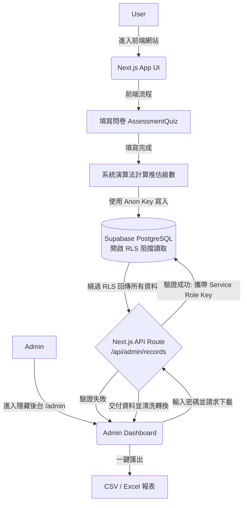

# Care Easy 照護一點通 - 系統技術架構文件

本文件描述了 **Care Easy 照護一點通** 長照補助試算平台的全端技術架構設計，包含前端框架、後端資料庫、系統部署環境及資料流動機制。

---

## 1. 系統整體架構 (System Architecture)

本專案採用現代化的 **Serverless 全端架構**，前端與部署緊密結合，後端採用 BaaS (Backend-as-a-Service) 模式，以達到開發快速、容易維護及高擴展性的目的。

* **前端框架與後端 API**：`Next.js` (React 框架，App Router 架構)
* **樣式設計**：`Tailwind CSS`
* **後端與資料庫**：`Supabase` (PostgreSQL)
* **部署與代管**：`Vercel` (Frontend Cloud)
* **版本控制**：`Git / GitHub`
* **報表處理**：`xlsx` (處理原生 Excel 格式匯出)

---

## 2. 前端架構 (Frontend)

前端主要職責為呈現流暢的使用者體驗 (UX)，並處理複雜的長照評估演算法。架構基於 **Next.js App Router**。

### 核心組件 (Components)
* `src/app/page.js`：系統主要入口與狀態總管 (State Manager)。負責管理「首頁選單」、「使用者旅程 (是否有申請過CMS)」以及「畫面分頁切換」。
* `src/components/AssessmentQuiz.jsx`：動態問卷組件。根據使用者是否為失智路徑，切換不同的題庫 (ADL vs CDR)，並在最後一題作答完畢後，發送資料至 Supabase。
* `src/components/SubsidyCalculator.jsx`：長照四包錢試算引擎。包含外籍看護工、交通分級、輔具選擇等複雜邏輯判斷，即時計算政府補助與自付額。
* `src/components/ResultTable.jsx`：各級數補助上限總覽表。
* `src/components/MoneyRow.jsx`：共用的金錢顯示微型組件，確保 UI 風格統一。

### 後台管理介面 (Admin)
* `src/app/admin/page.js`：隱藏的專屬報表匯出後台。具備基本的密碼驗證機制，可自動將凌亂的 JSON 問卷資料與英文代碼攤平，並即時翻譯為易讀的中文。支援一鍵匯出 **防亂碼 CSV** (寫入 UTF-8 BOM) 與 **原生 Excel (.xlsx)**。

### 工具與邏輯層 (Utils)
* `src/utils/careData.js`：將原先龐大且繁雜的常數（各項補助表、地區費率、評估題庫）與核心演算法（`estimateLevelDementia`, `estimateLevelNormal`）獨立抽離，確保 UI 畫面只專注在渲染。

---

## 3. 後端與資料庫架構 (Backend & Database)

採用 **Supabase** 替代傳統的自建後端 API，直接透過 Supabase SDK 存取位於雲端的 PostgreSQL 資料庫。同時結合 Next.js 的 Serverless API 路由，打造兼具便利與高度安全的架構。

### 核心資料表：`assessment_records`
此資料表負責儲存所有使用者的評估結果，主要作為未來機器學習 (AI) 模型訓練的 Ground Truth (真實標註資料) 來源。

**Schema 結構：**
* `id` (uuid): 唯一識別碼
* `created_at` (timestamp): 建立時間
* `has_applied_cms` (boolean): 是否曾申請過 CMS 補助
* `calculated_cms_level` (integer): 系統演算法推估出的 CMS 級數
* `actual_cms_level` (integer, nullable): 真實核定的級數（用於驗證系統推估的準確度）
* `answers` (jsonb): 完整的原始問卷作答記錄，保留最大彈性
* `is_dementia_path` (boolean): 紀錄該次評估是否走失智路徑

### 企業級安全性 (Security & RLS)
* **前端寫入權限 (Anon Key)**：透過 `src/lib/supabaseClient.js` 使用公開的 `NEXT_PUBLIC_SUPABASE_ANON_KEY`。在 PostgreSQL 的 **Row Level Security (RLS)** 嚴格防護下，預設允許任何人 (anon) 無需登入即可 `INSERT` 評估資料，但**絕對禁止前端讀取** (`SELECT`)，防止駭客竊取營運資料。
* **後端讀取權限 (Service Role Key)**：建立了一支 Next.js 伺服器端 API (`src/app/api/admin/records/route.js`)。前端後台頁面需攜帶通關密碼呼叫此 API，API 驗證成功後，透過 `src/lib/supabaseAdmin.js` 持有最高權限的 `SUPABASE_SERVICE_ROLE_KEY` (無敵金鑰)，合法繞過 RLS 的阻擋，將資料安全地拉取還給管理員。

---

## 4. 系統工作流程 (Workflow & Data Flow)

---

## 5. 未來擴充性規劃

由於資料庫採用 `JSONB` 欄位儲存所有的問卷答案，這為系統保留了極大的擴充彈性。
若未來想要開發 AI 自動判讀模型，營運團隊可直接從 `/admin` 匯出包含 `answers` (特徵值 Features) 與 `actual_cms_level` (目標變數 Labels) 的原生 Excel 報表，無縫接軌並投入深度學習的訓練流程。
