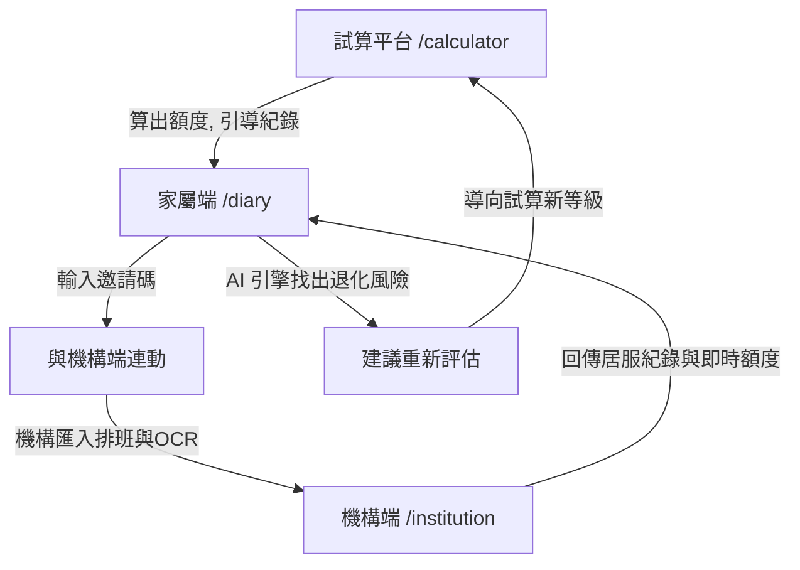

# Care Easy 照護一點通 - 系統技術架構文件 (v3.0 三端整合版)

本文件描述了 **Care Easy 照護一點通** 的全端技術架構設計，系統已於 v3.0 升級為整合「家屬端」、「機構端」與「試算平台」的完整長照生態系。

---

## 1. 系統整體架構 (System Architecture)

本專案採用現代化的 **Serverless 全端架構**，前端與部署緊密結合，並具備純函式演算引擎與雲端資料庫。

* **前端框架與路由**：`Next.js` (React 框架，App Router 架構)
* **樣式設計**：`Tailwind CSS`
* **狀態與邏輯抽離**：將 AI 訊號分析、對帳比對與費率常數抽離為獨立的純函式工具。
* **後端與資料庫**：`Supabase` (PostgreSQL)
* **報表匯出**：`xlsx` (處理核銷報表與異常附表)
* **部署與代管**：`Vercel` (Frontend Cloud)

---

## 2. 核心模組與路由 (Modules & Routing)

系統基於 Next.js App Router 規劃了三大主要服務入口，加上管理員後台，構成完整的飛輪閉環。

### 1️⃣ 試算平台 (`/calculator`)
* **核心功能**：引導民眾完成 ADL/CDR 評估，並即時運算長照四包錢（照顧服務、交通接送、輔具、喘息）的最高補助額度與自付額。
* **關鍵元件**：
  * `AssessmentQuiz.jsx`：動態問卷引擎，收集答案後送往 Supabase。
  * `SubsidyCalculator.jsx`：複雜補助規則演算。
  * `ResultTable.jsx`：總覽表，具備通往 `/diary` 的飛輪引導入口。

### 2️⃣ 家屬端：照護日誌與 AI 分析 (`/diary`)
* **核心功能**：提供家屬紀錄日常觀察，與機構（居服員）紀錄連動，並透過 AI 引擎即時分析退化風險。
* **關鍵元件 (`FamilyDiaryV3.jsx`)**：
  * **雙軌紀錄**：整合家屬的「快速標籤與文字觀察」與居服員的「生理量測與服務項目」。
  * **連動機制**：支援輸入機構邀請碼綁定個案，並設有嚴格的家屬日誌隱私保護。
  * **AI 訊號分析面板**：將雙端紀錄交叉比對，找出「兩端一致」或「單側觀察」的異常訊號，並在風險過高時主動建議「重新試算」。

### 3️⃣ 機構端：核銷與對帳中心 (`/institution`)
* **核心功能**：機構督導的數位工作站，處理排班、OCR 掃描驗證與政府核銷報表。
* **關鍵元件 (`InstitutionDashboard.jsx`)**：
  * **OCR Human-in-the-loop**：防呆機制強制督導複查信心度低於 0.85 的欄位。
  * **紙本對帳比對室**：視覺化顯示 D1 (疑似未執行)、D2 (計畫外服務)、D3 (時數差異)、D4 (項目差異) 的五色狀態。
  * **防溢報匯出**：將資料分流為「核銷明細」與「異常附表」，D1 永久隔離於請款名單外。

---

## 3. 純函式引擎與常數庫 (Utility Engines)

系統將核心商業邏輯自 UI 層抽離，確保高可測試性與法規對齊。

* **`src/utils/careData.js`**：唯一的法規與費率 Truth。包含 `BA_MAP` (服務單價)、`CARE_SUBSIDY` (級數額度) 與 `IDENTITY_RATES` (身分別負擔比率)。**嚴格禁止於其他元件 hardcode 金額**。
* **`src/utils/signalEngine.js`**：AI 照護訊號引擎。將家屬日誌與居服紀錄正規化，根據醫療閾值推導出「退化訊號」(Red/Amber)，驅動家屬端的 AI 分析面板。
* **`src/utils/reconcile.js`**：機構端差異比對引擎。採用精準的**兩輪配對演算法**，嚴格遵守「以紙本為準」的申報原則處理 CSV 與 OCR 資料的衝突。

---

## 4. 飛輪與資料流動 (Flywheel & Data Flow)

系統的 UX 設計為一個生生不息的飛輪，透過各端點互相引導，最大化用戶留存與資料收集價值。

---

## 5. 後端與資料庫架構 (Supabase & RLS)

* **評估紀錄表 (`assessment_records`)**：儲存使用者的問卷結果 (`answers`) 與系統推估級數，作為未來訓練 AI 模型的特徵與標籤。
* **安全性設計 (Row Level Security)**：
  * **前端寫入 (Anon Key)**：開放任意寫入，但嚴格阻擋讀取。
  * **後端拉取 (Service Role Key)**：`/admin` 路由透過伺服器端 API (`/api/admin/records`) 驗證管理員密碼後，繞過 RLS 撈取資料進行 CSV/Excel 報表匯出。

## 6. 未來擴充
目前機構端的「邀請碼連動」為前端 Mock 流程，未來將藉由 Supabase 建立 `users`, `institutions`, `cases` 的關聯表，實現真正的 JWT 驗證與資料隔離權限控管。
